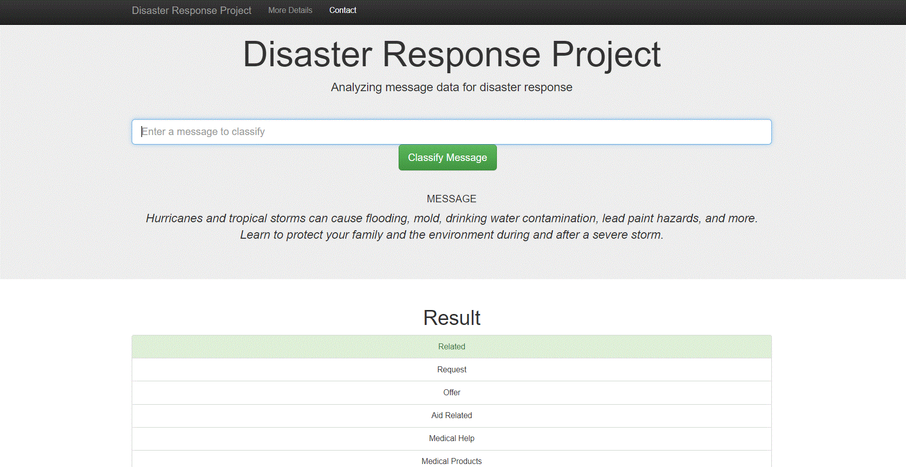

# Disaster Response Pipeline Project
This project is to develop disaster message classification models using machine learning techniques. The data is provided by Figure 8, and the trained model has been deployed on Heroku as a web app (https://drtestxu.herokuapp.com/). This trained model is a multiclass classfiers which include 36 types of responses, including related, aid related, clothing, flood, water, missing people etc. 

### Deployed Heroku app
https://disaster-response-xu-created.herokuapp.com/

### Data
Two data files are provided:
	* messages data: this data file include the messages received related disaster(including English translated version and original version). Not all of the messages are disaster related - some of them might just used sensitive words on thier normal social media. So one of this classifier's goals is to identify which messages we need to respond. 
    * disaster categories data: this data is actually the labels of messages data. The messages data was manually classified into 36 responses.
    
### Data Cleaning
The data cleaning include:
	- remove the punctuation
    - remove the duplicates
    - restructure the tables
    - tokenize the sentences
    - Eliminate capitalization

### Data Model Development
The KNN model is currenlty used to classify the disaster events. Data Pipeline has been built include tokenizer and Tfidf transfomers. GridsearchCV is used to tune the parameters. And the trained model is saved as .pkl file.

### Repository layout
`
├── DRapp
│   ├── __init__.py
│   ├── run.py
│   └── templates
│       ├── go.html
│       └── master.html
├── data
│   ├── disaster_categories.csv
│   ├── disaster_messages.csv
│   └──process_data.py
│
├── models
│   ├── classifier.pkl
│   └── train_classifier.py
│
├── utils
│   ├── __init__.py
│   └── tokenizer.py
│
├── .gitattibutes
├── DisasterResponse.db
├── Procfile
├── README.md
├── requirement.txt
├── disasterresponse.py
└── runtime.txt
`

### How to run the code locally:
1. Run the following commands in the project's root directory to set up your database and model.

    - To run ETL pipeline that cleans data and stores in database
        `python data/process_data.py data/disaster_messages.csv data/disaster_categories.csv data/DisasterResponse.db`
    - To run ML pipeline that trains classifier and saves
        `python models/train_classifier.py data/DisasterResponse.db models/classifier.pkl`

2. Go to `app` directory: `cd DRapp`

3. Run your web app: `python run.py`
    - uncommentted:  Line 16  app = Flask(__name__)
    				 Line 123 def main():
                	 Line 124    app.run(host='0.0.0.0', port=3000, debug=True)
                	 Line 127 if __name__ == '__main__':
                	 Line 128    main()
    - commentted:    Line 13 from DRapp import app

4. Go to http://0.0.0.0:3000/

### Things worthwhile to note

	- There is a limit of large file uploading on Github (>100Mb). git-lfs is required to upload large files. The following codes can be used:
    		* initialization:  			git init
            * install lfs:     			git lfs install
            * track the large file:		git lfs track 'models/classifier.pkl'
            * upload config file:		git add .gitattributes
            							git commit -m 'large - init file'
                                        git push -u origin main
                                        
            * upload the large file:	git add 'models/classifier.pkl'
            							git commit -m 'upload Big file.'
                                        git push
            * upload the rest files:	git add .
            							git commit -m 'upload the rest files.'
                                        git push
                                        
	- If Github stuck with uploading large files, the solution would be remove .git folder and redo everything. I have tried revoking large files commands with command "git reset --hard xxx" where xxx is the id of the commit. And commit id can be checked with the command "git log". However, this doesn't work.
    
    - There are couple of points for deploying the model on Heroku:
    		* sqlalchemy library can only read sql files in current path. Don't use absolute directory or relative directory to read file
            * requirements.txt can tell Heroku what libraries are required; runtime.txt can tell Heroku the version of python (some of the python libraries do work for Heroku stack; the work uses python-3.7.12); Procfile tells Heroku where is the entry of the web.
            * some customised tools are better to be created in a seperated file rather defined in run.py e.g. utils folder for this example. Otherwise, Heroku might skip the function definition and it might fails to identify the function.
            * __init__.py is always required to tell run.py where to find the imported libraries.
			* the training data is imbalance which could affect the model result - the weight of large size classes could be higher than small size classes. Compared with the accuracy, f1-score might be a better indicator. Additionally, generating more data for small size classes could improve the training steps (the simplest way is to copy existed data to make all classes in the same volumn). However, due to the availability, this project just ends with a sample model for now. The improvement might be conducted in future.
            
### Result and snapshots of performance of models

